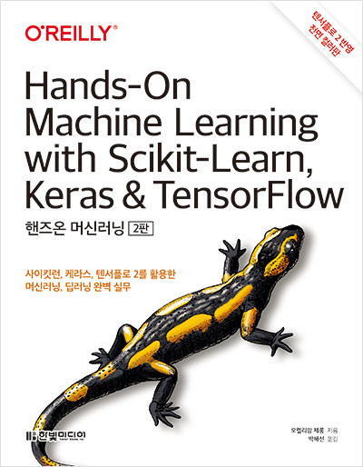

# handson-ml2-review
<a href="https://www.hanbit.co.kr/media/books/book_view.html?p_code=B7033438574">Aurelien Geron 저, 박해선 역 - 『Hands-on Machine Learning with Scikit-Learn, Keras & Tensorflow』</a>를 공부하여 내용을 정리합니다.

author's github source repo: <a href="https://github.com/ageron/handson-ml2">click here</a>

## :dart: ​목적

1. 3분 딥러닝 공부 이후, 딥러닝 동작 및 구현 방식에 대한 발전된 이해
2. Tensorflow, Keras 코드를 Pytorch 화하여 구현 pipeline 및 차이점에 대한 이해 
3. 18장. 강화학습 chapter를 통한 강화학습 전반에 대한 발전된 이해 

## :clipboard: 목차

### 1부. ML

### 2부. DL

10. <a href="https://github.com/JerryKwon/handson-ml2-review/blob/main/part2.%20DL/10.%20%EC%BC%80%EB%9D%BC%EC%8A%A4%EB%A5%BC%20%EC%82%AC%EC%9A%A9%ED%95%9C%20%EC%9D%B8%EA%B3%B5%20%EC%8B%A0%EA%B2%BD%EB%A7%9D%20%EC%86%8C%EA%B0%9C/10.%20%EC%BC%80%EB%9D%BC%EC%8A%A4%EB%A5%BC%20%EC%82%AC%EC%9A%A9%ED%95%9C%20%EC%9D%B8%EA%B3%B5%20%EC%8B%A0%EA%B2%BD%EB%A7%9D%20%EC%86%8C%EA%B0%9C.ipynb">케라스를 통한 신경망에 대한 소개</a>(11/3~11/5)
11. 심층 신경망 훈련하기
12. 텐서플로를 사용한 사용자 정의 모델과 훈련
13. 텐서플로에서 데이터 적재와 전처리하기
14. 합성곱 신경망을 사용한 컴퓨터 비전
15. RNN과 CNN을 사용해 시퀀스 만들기
16. RNN과 어텐션을 사용한 자연어 처리
17. 오토인코더와 GAN을 사용한 표현 학습과 생성적 학습
18. <a href="https://github.com/JerryKwon/handson-ml2-review/blob/main/part2.%20DL/18.%20%EA%B0%95%ED%99%94%20%ED%95%99%EC%8A%B5/18.%20%EA%B0%95%ED%99%94%20%ED%95%99%EC%8A%B5.ipynb">강화 학습</a>(11/6~) 